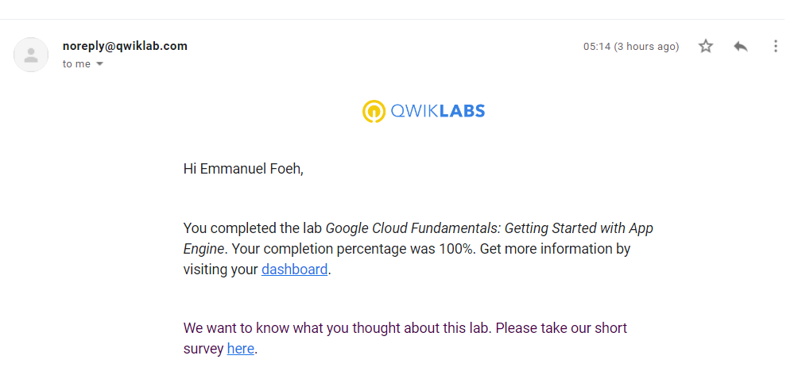

<!-- Change title below -->

# Getting started with App Engine 

## QwikLabs Completed

<details>
  <summary>Lab: Getting started with App Engine </summary>
  
</details>

## Translation code for Getting started with App Engine

```
Google Cloud Fundamentals: Getting Started with App Engine
1 Task 1: Initialize App Engine
Initialize your App Engine app with your project and choose its region:

gcloud app create --project=$DEVSHELL_PROJECT_ID

2 Clone the source code repository for a sample application in the hello_world directory:

git clone https://github.com/GoogleCloudPlatform/python-docs-samples

3 Navigate to the source directory:

cd python-docs-samples/appengine/standard_python3/hello_world

Task 2: Run Hello World application locally
1 Execute the following command to download and update the packages list.

sudo apt-get update

Set up a virtual environment in which you will run your application. Python virtual environments are used to isolate package installations from the system.

sudo apt-get install virtualenv
If prompted [Y/n], press Y and then Enter.
virtualenv -p python3 venv

3 Activate the virtual environment.

source venv/bin/activate

4 Navigate to your project directory and install dependencies.

pip install  -r requirements.txt

5 Run the application:

python main.py
6 In Cloud Shell, click Web preview (Web Preview) > Preview on port 8080 to preview the application.
7 To end the test, return to Cloud Shell and press Ctrl+C to abort the deployed service.


Task 3: Deploy and run Hello World on App Engine

To deploy your application to the App Engine Standard environment:

1 Navigate to the source directory:

cd ~/python-docs-samples/appengine/standard_python3/hello_world

2 Deploy your Hello World application.

gcloud app deploy

If prompted "Do you want to continue (Y/n)?", press Y and then Enter.
3 Launch your browser to view the app at http://YOUR_PROJECT_ID.appspot.com

gcloud app browse


```
