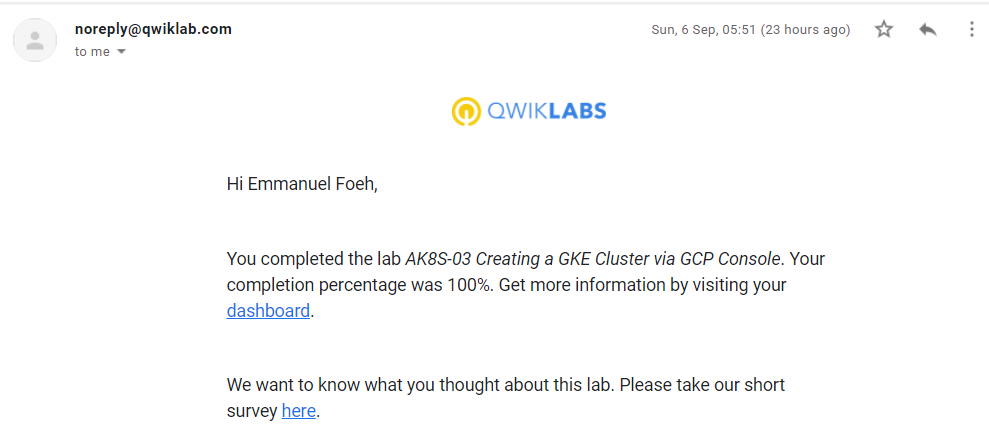
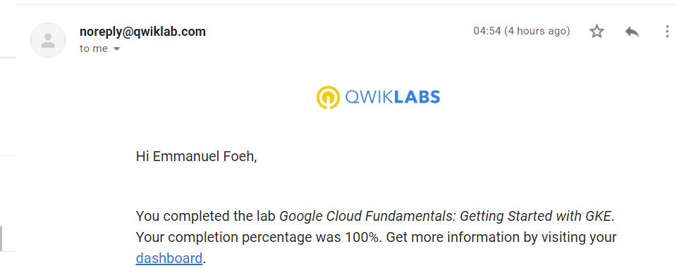

<!-- Change title below -->

# gads-2020-project

## QwikLabs Completed

<details>
  <summary>Lab: AK8s-03 Creating a GKE via GCP Console</summary>
  
</details>

<details>
  <summary>Lab 15: Getting stated with GKE</summary>
  
</details>

## Translation code Creating a GKE via GCP Console

```
creating GKE cluster via clould shell

1 In GCP console, on the top right toolbar, click the Open Cloud Shell button.

You can list the active account name with this command:

gcloud auth list

You can list the project ID with this command:

gcloud config list project

Task 1. Deploy GKE clusters
1 In Cloud Shell, type the following command to set the environment variable for the zone and cluster name.

export my_zone=us-central1-a
export my_cluster=standard-cluster-1
2 In Cloud Shell, type the following command to create a Kubernetes cluster.

gcloud container clusters create $my_cluster --num-nodes 3 --zone $my_zone --enable-ip-alias

Task 2. Modify GKE clusters
1 In Cloud Shell, execute the following command to modify standard-cluster-1 to have four nodes:

gcloud container clusters resize $my_cluster --zone $my_zone --size=4

2 When prompted with Do you want to continue (Y/n), press y to confirm.

Task 3. Connect to a GKE cluster

1 To create a kubeconfig file with the credentials of the current user (to allow authentication) and 
provide the endpoint details for a specific cluster (to allow communicating with that cluster 
through the kubectl command-line tool), execute the following command:

gcloud container clusters get-credentials $my_cluster --zone $my_zone

2 Open the kubeconfig file with the nano text editor:

nano ~/.kube/config

3 Press CTRL+X to exit the nano editor.

Task 4. Use kubectl to inspect a GKE cluster

1 In Cloud Shell, execute the following command to print out the content of the kubeconfig file:

kubectl config view
2 In Cloud Shell, execute the following command to print out the cluster information for the active context:

kubectl cluster-info

3 In Cloud Shell, execute the following command to print out the active context:

kubectl config current-context

4 In Cloud Shell, execute the following command to print out some details for all the cluster contexts in the kubeconfig file:

kubectl config get-contexts

5 In Cloud Shell, execute the following command to change the active context:

kubectl config use-context gke_${GOOGLE_CLOUD_PROJECT}_us-central1-a_standard-cluster-1

6 In Cloud Shell, execute the following command to view the resource usage across the nodes of the cluster:

kubectl top nodes

7 In Cloud Shell, type kubectl and press the Tab key twice.

9 In Cloud Shell, type kubectl co and press the Tab key twice.

Task 5. Deploy Pods to GKE clusters

1 In Cloud Shell, execute the following command to deploy the latest version of nginx as a Pod named nginx-1:

kubectl run nginx-1 --image nginx:latest

2 In Cloud Shell, execute the following command to view all the deployed Pods in the active context cluster:

kubectl get pods

3 You will now enter your Pod name into a variable that we will use throughout this lab. 
Using variables like this can help you minimize human error when typing long names.
 You must type your Pod's unique name in place of [your_pod_name].

export my_nginx_pod=[your_pod_name] #nginx-1-74c7bbdb84-nvwsc

4 Confirm that you have set the environment variable successfully by having the shell echo the value back to you:

echo $my_nginx_pod

5 In Cloud Shell, execute the following command to view the complete details of the Pod you just created.

kubectl describe pod $my_nginx_pod


Push a file into a container

1 In Cloud Shell, type the following commands to open a file named test.html in the nano text editor.

nano ~/test.html

2 Add the following text (shell script) to the empty test.html file:

<html> <header><title>This is title</title></header>
<body> Hello world </body>
</html>

3 Press CTRL+X, then press Y and enter to save the file and exit the nano editor.

4 In Cloud Shell, execute the following command to place the file into the appropriate 
location within the nginx container in the nginx Pod to be served statically:

kubectl cp ~/test.html $my_nginx_pod:/usr/share/nginx/html/test.html

Expose the Pod for testing

In Cloud Shell, execute the following command to create a service to expose our nginx Pod externally:

kubectl expose pod $my_nginx_pod --port 80 --type LoadBalancer

2 In Cloud Shell, execute the following command to view details about services in the cluster:

kubectl get services

3 In Cloud Shell, execute the following command to verify that the nginx container is serving the static HTML file that you copied.
curl http://[EXTERNAL_IP]/test.html
4 In Cloud Shell, execute the following command to view the resources being used by the nginx Pod:

kubectl top pods

Prepare the environment

1 In Cloud Shell enter the following command to clone the repository to the lab Cloud Shell.

git clone https://github.com/GoogleCloudPlatformTraining/training-data-analyst

2 Change to the directory that contains the sample files for this lab.

cd ~/training-data-analyst/courses/ak8s/04_GKE_Shell/

3 To deploy your manifest, execute the following command:

kubectl apply -f ./new-nginx-pod.yaml

4 To see a list of Pods, execute the following command:

kubectl get pods

5 In Cloud Shell, execute the following command to start an interactive bash shell in the nginx container:

kubectl exec -it new-nginx /bin/bash

6 In Cloud Shell, in the nginx bash shell, execute the following commands to install the nano text editor:

apt-get update
apt-get install nano

7 In Cloud Shell, in the nginx bash shell, 
execute the following commands to switch to the static files directory and create a test.html file:

cd /usr/share/nginx/html
nano test.html

8 In Cloud Shell, in the nginx bash shell nano session, type the following text:

<html> <header><title>This is title</title></header>
<body> Hello world </body>
</html>

9 Press CTRL+X, then press Y and enter to save the file and exit the nano editor.

10 In Cloud Shell, in the nginx bash shell, execute the following command to exit the nginx bash shell:

exit

11 In Cloud Shell, execute the following command to set up port forwarding from 
Cloud Shell to the nginx Pod (from port 10081 of the Cloud Shell VM to port 80 of the nginx container):

kubectl port-forward new-nginx 10081:80

12 In the Cloud Shell menu bar, click the plus sign (+) icon to start a new Cloud Shell session.

13 In the second Cloud Shell session, 
execute the following command to test the modified nginx container through the port forwarding:

curl http://127.0.0.1:10081/test.html

14 In the Cloud Shell menu bar, click the plus sign (+) icon to start another new Cloud Shell session.

15 In third Cloud Shell window, execute the following command to display the logs and to stream
 new logs as they arrive (and also include timestamps) for the new-nginx Pod:

kubectl logs new-nginx -f --timestamps

16 You will see the logs display in this new window
17 Return to the second Cloud Shell window and re-run the curl command to generate some traffic on the Pod.

18 Close the third Cloud Shell window to stop displaying the log messages.
19 Close the original Cloud Shell window to stop the port forwarding process.

```

## Translation code for Getting started with GKE
~~~~~
For convenience, place the zone that Qwiklabs assigned you to into an environment variable called MY_ZONE.
 At the Cloud Shell prompt, type this partial command:

export MY_ZONE=

followed by the zone that Qwiklabs assigned to you. 
Your complete command will look similar to this:

export MY_ZONE=us-central1-a

1 Start a Kubernetes cluster managed by Kubernetes Engine.
Name the cluster webfrontend and configure it to run 2 nodes:

gcloud container clusters create webfrontend --zone $MY_ZONE --num-nodes 2

Note: It takes several minutes to create a cluster as Kubernetes Engine provisions virtual machines for you.

2 After the cluster is created, check your installed version of Kubernetes using the kubectl version command:

kubectl version

Task 2: Run and deploy a container

1 From your Cloud Shell prompt, launch a single instance of the nginx container.

kubectl create deploy nginx --image=nginx:1.17.10

2 View the pod running the nginx container:

kubectl get pods

3 Expose the nginx container to the Internet:

kubectl expose deployment nginx --port 80 --type LoadBalancer

4 View the new service:

kubectl get services

5 Open a new web browser tab and paste your cluster's external IP address into the address bar. 
The default home page of the Nginx browser is displayed.

6 Scale up the number of pods running on your service:

kubectl scale deployment nginx --replicas 3

7 Confirm that Kubernetes has updated the number of pods:

kubectl get pods

8 Confirm that your external IP address has not changed:

kubectl get services

9 Return to the web browser tab in which you viewed your cluster's external IP address. 
Refresh the page to confirm that the nginx web server is still responding.
~~~~~
